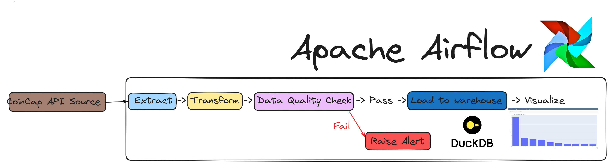
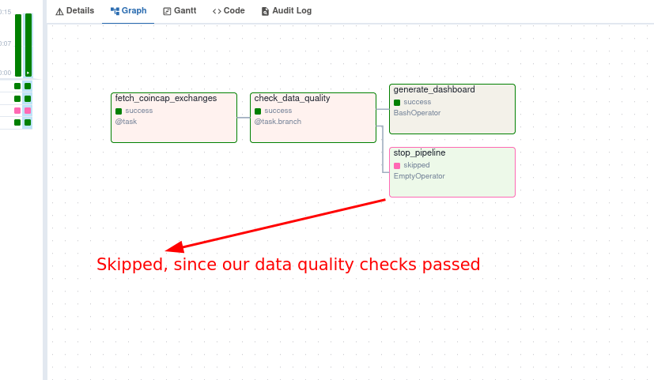
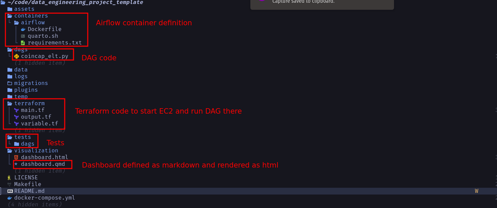
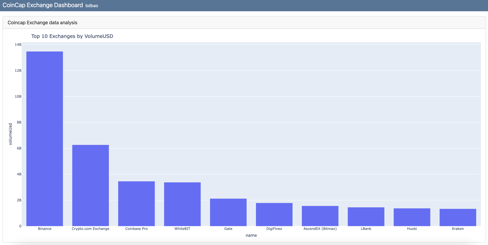

- [Data engineering ETL project](#data-engineering-etl-project)
    - [Run locally](#run-locally)
  - [Architecture and services in this template](#architecture-and-services-in-this-template)
  - [Writing pipelines](#writing-pipelines)


# Data engineering ETL project
### Run locally

To run locally, you need:

1. [git](https://git-scm.com/book/en/v2/Getting-Started-Installing-Git)
2. [Github account](https://github.com/)
3. [Docker](https://docs.docker.com/engine/install/) with at least 4GB of RAM and [Docker Compose](https://docs.docker.com/compose/install/) v1.27.0 or later

Clone the repo and run the following commands to start the data pipeline:

```bash
git clone https://github.com/bdbao/etl-coincap.git
cd etl-coincap
make up
sleep 30 # wait for Airflow to start
make ci # run checks and tests
```
Go to [http:localhost:8080](http:localhost:8080) to see the Airflow UI. Username and password are both `airflow`.

## Architecture and services in this template

This data engineering project template, includes the following:

1. **`Airflow`**: To schedule and orchestrate DAGs.
2. **`Postgres`**: To store Airflow's details (which you can see via Airflow UI) and also has a schema to represent upstream databases.
3. **`DuckDB`**: To act as our warehouse
4. **`Quarto with Plotly`**: To convert code in `markdown` format to html files that can be embedded in your app or servered as is.
5. **`cuallee`**: To run data quality checks on the data we extracted from CoinCap API.
6. **`minio`**: To provide an S3 compatible open source storage system.

For simplicity services 1-5 of the above are installed and run in one container defined [here](./containers/airflow/Dockerfile).



The `coincap_elt` DAG in the [Airflow UI](http://localhost:8080) will look like the below image:



You can see the rendered html at [./visualizations/dashboard.html](https://github.com/josephmachado/data_engineering_project_template/blob/main/visualization/dashboard.html).

The file structure of our repo is as shown below:



## Writing pipelines

We have a sample pipeline at [coincap_elt.py](./dags/coincap_elt.py) that you can use as a starter to create your own DAGs. The tests are available at [./tests](./tests) folder.

Once the `coincap_elt` DAG runs, we can see the dashboard html at [./visualization/dashboard.html](./visualization/dashboard.html) and will look like .

<!---
## (Optional) Advanced cloud setup

If you want to run your code on an EC2 instance, with terraform, follow the steps below.

### Prerequisites:

1. [Terraform](https://learn.hashicorp.com/tutorials/terraform/install-cli) 
2. [AWS account](https://aws.amazon.com/) 
3. [AWS CLI installed](https://docs.aws.amazon.com/cli/latest/userguide/install-cliv2.html) and [configured](https://docs.aws.amazon.com/cli/latest/userguide/cli-chap-configure.html)

You can create your GitHub repository based on this template by clicking on the `Use this template button in the **[data_engineering_project_template](https://github.com/josephmachado/data_engineering_project_template)** repository. Clone your repository and replace content in the following files

1. **[CODEOWNERS](https://github.com/josephmachado/data_engineering_project_template/blob/main/.github/CODEOWNERS)**: In this file change the user id from `@josephmachado` to your Github user id.
2. **[cd.yml](https://github.com/josephmachado/data_engineering_project_template/blob/main/.github/workflows/cd.yml)**: In this file change the `data_engineering_project_template` part of the `TARGET` parameter to your repository name.
3. **[variable.tf](https://github.com/josephmachado/data_engineering_project_template/blob/main/terraform/variable.tf)**: In this file change the default values for `alert_email_id` and `repo_url` variables with your email and [github repository url](https://www.theserverside.com/blog/Coffee-Talk-Java-News-Stories-and-Opinions/GitHub-URL-find-use-example) respectively.

Run the following commands in your project directory.

```shell
# Create AWS services with Terraform
make tf-init # Only needed on your first terraform run (or if you add new providers)
make infra-up # type in yes after verifying the changes TF will make

# Wait until the EC2 instance is initialized, you can check this via your AWS UI
# See "Status Check" on the EC2 console, it should be "2/2 checks passed" before proceeding
# Wait another 5 mins, Airflow takes a while to start up
# Link: https://us-east-1.console.aws.amazon.com/ec2/home?region=us-east-1#Instances:

make cloud-airflow # this command will forward Airflow port from EC2 to your machine and opens it in the browser
# the user name and password are both airflow

make cloud-metabase # this command will forward Metabase port from EC2 to your machine and opens it in the browser
# use https://github.com/josephmachado/data_engineering_project_template/blob/main/env file to connect to the warehouse from metabase
```

For the [continuous delivery](https://github.com/josephmachado/data_engineering_project_template/blob/main/.github/workflows/cd.yml) to work, set up the infrastructure with terraform, & defined the following repository secrets. You can set up the repository secrets by going to `Settings > Secrets > Actions > New repository secret`.

1. **`SERVER_SSH_KEY`**: We can get this by running `terraform -chdir=./terraform output -raw private_key` in the project directory and paste the entire content in a new Action secret called SERVER_SSH_KEY.
2. **`REMOTE_HOST`**: Get this by running `terraform -chdir=./terraform output -raw ec2_public_dns` in the project directory.
3. **`REMOTE_USER`**: The value for this is **ubuntu**.

### Tear down infra

After you are done, make sure to destroy your cloud infrastructure.

```shell
make down # Stop docker containers on your computer
make infra-down # type in yes after verifying the changes TF will make
```


```bash
brew install awscli
aws --version
aws configure


for line in (cat .env)
    set -gx (echo $line | cut -d '=' -f1) (echo $line | cut -d '=' -f2-)
end
echo $AWS_ACCESS_KEY_ID
echo $AWS_SECRET_ACCESS_KEY
echo $AWS_DEFAULT_REGION
```

Log into AWS Console. (https://us-east-1.console.aws.amazon.com/iam/home?region=us-east-1#/users/details/aws_01?section=permissions)
Go to IAM > Users.
Select the user aws_01.
Click Add permissions → Attach policies directly.
Search for and attach the policy: AdministratorAccess.
Click Add permissions.
-->
